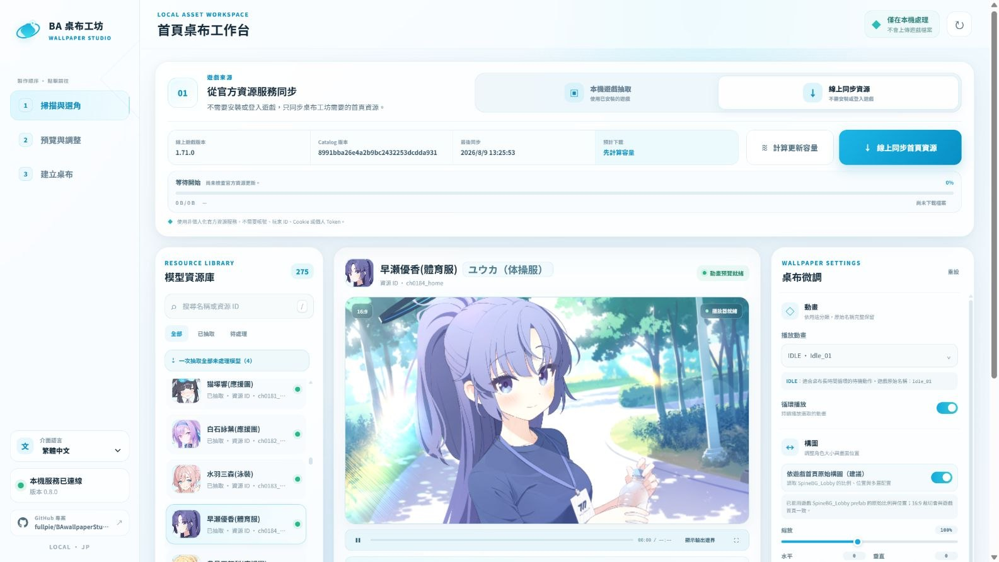

# BA Wallpaper Studio

  <strong>Turn Blue Archive lobby animations into Wallpaper Engine wallpapers.</strong>

  <a href="#english">English</a> ·
  <a href="#繁體中文">繁體中文</a> ·
  <a href="#日本語">日本語</a>

  

  <a href="https://github.com/fullpie/BAwallpaperStudio/releases/latest"><strong>Download the latest Windows release</strong></a>

---

## English

BA Wallpaper Studio is a local Windows application that extracts or synchronizes Blue Archive lobby animations, previews their in-game composition, and installs them as Wallpaper Engine wallpapers.

### Resource sources

- **Local extraction:** Read the required lobby Live2D assets from an installed Blue Archive JP PC client without modifying the game files.
- **Official CDN synchronization:** Download only the required lobby Live2D assets from Blue Archive's official CDN without launching the game.

Both sources use the same loading, preview, composition adjustment, and Wallpaper Engine export workflow. CDN synchronization requires an internet connection, but no Blue Archive account, login, or player token. It is an unofficial integration based on the current distribution protocol—not an officially guaranteed stable API—so upstream changes may temporarily suspend online synchronization until the tool is updated.

### Features

- Preview animations and restore the original in-game lobby composition.
- Supports 16:9, 16:10, 3:4, and custom output ratios.
- Fine-tune scale and horizontal or vertical position before export.
- Create, install, and test the wallpaper directly in Wallpaper Engine.
- Traditional Chinese, English, and Japanese interface.
- Exported Wallpaper Engine settings automatically follow the Wallpaper Engine interface language.
- Optional 2× anime texture enhancement with `waifu2x-ncnn-vulkan`.
- Checks GitHub Releases for newer stable versions.
- All processing is performed locally on your computer.

### Rendering resolution and optional 4K enhancement

The wallpaper follows Wallpaper Engine's active resolution. Optional **waifu2x 2×** improves clarity on 4K displays, but does not turn the source artwork into native 4K.

### Quick start

1. Download the latest package from [GitHub Releases](https://github.com/fullpie/BAwallpaperStudio/releases/latest).
2. Extract the complete package to a writable folder.
3. Run `BA桌布工坊.exe`.
4. Select an installed Blue Archive folder for local extraction, or use official CDN synchronization.
5. Select a character and load the required resources.
6. Preview the animation and adjust the composition if needed.
7. Select **Create and install wallpaper**.
8. Confirm the result in the Wallpaper Engine test window before applying it to the desktop.

### Requirements

- Windows 10 or Windows 11
- Wallpaper Engine
- Internet access when synchronizing resources, checking updates, or downloading the optional enhancement engine
- A Vulkan-compatible GPU for waifu2x enhancement

### Privacy

- Game files are read only and are never modified.
- Game resources are not uploaded.
- No Blue Archive login, player token, or cookie is collected.
- No permanent user or system environment variables are added.
- Extracted resources, caches, and exports remain on the user's computer.

### Disclaimer

BA Wallpaper Studio is an unofficial fan-made tool and is not affiliated with Yostar, NEXON Games, Nexon, or the Blue Archive development team.

Blue Archive and all related game assets belong to their respective rights holders. This repository and its releases do not include game assets.

The application is provided free for personal, non-commercial use. Do not resell the application, charge for repackaged copies, or redistribute extracted game resources.

---

## 繁體中文

BA 桌布工坊是一款 Windows 本機工具，可抽取或同步 Blue Archive 首頁動畫，預覽遊戲內原始構圖，並建立及安裝 Wallpaper Engine 動態桌布。

### 資源取得方式

- **本機抽取：** 從已安裝的 Blue Archive JP PC 版讀取所需的首頁 Live2D 資源，不會修改遊戲檔案。
- **官方 CDN 同步：** 不必開啟遊戲，直接從 Blue Archive 官方 CDN 下載所需的首頁 Live2D 資源。

兩種來源共用相同的載入、預覽、構圖調整與 Wallpaper Engine 匯出流程。CDN 同步需要網路，但不需要 Blue Archive 帳號、登入資料或玩家 Token。此功能是依目前資源配發協定實作的非官方整合，並非官方保證穩定的 API；若上游協定變更，線上同步可能暫時停用，直到程式更新。

### 主要功能

- 預覽動畫並還原遊戲首頁原始構圖。
- 支援 16:9、16:10、3:4 及自訂輸出比例。
- 匯出前可微調縮放、水平與垂直位置。
- 直接建立、安裝並測試 Wallpaper Engine 桌布。
- 支援繁體中文、英文與日文介面。
- 輸出的 Wallpaper Engine 設定會依其介面語言自動切換。
- 可選擇使用 `waifu2x-ncnn-vulkan` 進行 2× 動漫貼圖高清化。
- 啟動時檢查 GitHub Releases 是否有穩定新版。
- 所有處理都在使用者的電腦上完成。

### 渲染解析度與選用的 4K 強化

桌布會依 Wallpaper Engine 的實際解析度繪製；可選的 **waifu2x 2×** 能改善 4K 顯示清晰度，但不會把原始素材變成原生 4K。

### 快速開始

1. 從 [GitHub Releases](https://github.com/fullpie/BAwallpaperStudio/releases/latest) 下載最新程式包。
2. 將完整程式包解壓縮至可寫入的資料夾。
3. 執行 `BA桌布工坊.exe`。
4. 指定已安裝的 Blue Archive 資料夾進行本機抽取，或使用官方 CDN 同步。
5. 選擇角色並載入所需資源。
6. 預覽動畫，需要時調整構圖。
7. 按下「建立並安裝桌布」。
8. 在 Wallpaper Engine 測試視窗確認後，再套用至桌面。

### 系統需求

- Windows 10 或 Windows 11
- Wallpaper Engine
- 同步資源、檢查更新或下載選用高清化引擎時需要網路
- 使用 waifu2x 高清化時需要支援 Vulkan 的顯示卡

### 隱私

- 只讀取遊戲檔案，不會修改遊戲安裝內容。
- 不會上傳遊戲資源。
- 不會收集 Blue Archive 登入資料、玩家 Token 或 Cookie。
- 不會新增永久性的使用者或系統環境變數。
- 抽取資源、快取與輸出內容都保存在使用者的電腦上。

### 聲明

BA 桌布工坊是非官方同人工具，與 Yostar、NEXON Games、Nexon 及 Blue Archive 開發團隊沒有隸屬或合作關係。

Blue Archive 及相關遊戲素材的權利歸原權利人所有。本倉庫及程式包不包含遊戲素材。

本程式免費提供個人、非商業用途。請勿轉售程式、收費提供重新包裝版本，或散布抽取出的遊戲資源。

---

## 日本語

BA Wallpaper Studio は、Blue Archive のホーム画面アニメーションを抽出または同期し、ゲーム内の元の構図を確認して Wallpaper Engine にインストールできる Windows 向けローカルツールです。

### リソースの取得方法

- **ローカル抽出：** インストール済みの Blue Archive JP PC 版から、必要なホーム画面の Live2D リソースをゲームファイルを変更せずに読み込みます。
- **公式CDN同期：** ゲームを起動せず、Blue Archive の公式CDNから必要なホーム画面の Live2D リソースだけをダウンロードします。

どちらの取得方法でも、その後は同じ読み込み、プレビュー、構図調整、Wallpaper Engine へのエクスポート手順を使用します。CDN同期にはインターネット接続が必要ですが、Blue Archive のアカウント、ログイン情報、プレイヤートークンは不要です。この機能は現在の配信プロトコルに基づく非公式連携であり、公式に安定性が保証されたAPIではありません。上流の仕様が変更された場合、ツールが更新されるまでオンライン同期が一時的に利用できなくなることがあります。

### 主な機能

- アニメーションをプレビューし、ゲーム内ホーム画面の元の構図を再現。
- 16:9、16:10、3:4、カスタム比率に対応。
- エクスポート前に拡大率、水平位置、垂直位置を微調整可能。
- Wallpaper Engine 用壁紙の作成、インストール、テストを直接実行。
- 繁體中文、English、日本語のインターフェースに対応。
- 出力された Wallpaper Engine の設定項目は、その表示言語に合わせて自動的に切り替わります。
- `waifu2x-ncnn-vulkan` による任意の2倍アニメ画像高画質化。
- 起動時に GitHub Releases の安定版アップデートを確認。
- すべての処理はユーザーのPC内で行われます。

### レンダリング解像度と任意の4K向け高画質化

壁紙は Wallpaper Engine の実際の解像度で描画されます。任意の **waifu2x 2×** は4K表示を鮮明にしますが、元素材をネイティブ4Kに変換するものではありません。

### クイックスタート

1. [GitHub Releases](https://github.com/fullpie/BAwallpaperStudio/releases/latest) から最新版をダウンロードします。
2. パッケージ全体を書き込み可能なフォルダーへ展開します。
3. `BA桌布工坊.exe` を起動します。
4. インストール済みの Blue Archive フォルダーを指定してローカル抽出するか、公式CDN同期を使用します。
5. キャラクターを選択し、必要なリソースを読み込みます。
6. アニメーションを確認し、必要に応じて構図を調整します。
7. 「壁紙を作成してインストール」を選択します。
8. Wallpaper Engine のテスト画面で確認してからデスクトップに適用します。

### 動作環境

- Windows 10 または Windows 11
- Wallpaper Engine
- リソース同期、アップデート確認、任意の高画質化エンジン取得時はインターネット接続が必要
- waifu2x 高画質化には Vulkan 対応GPUが必要

### プライバシー

- ゲームファイルは読み取り専用で、変更されません。
- ゲームリソースはアップロードされません。
- Blue Archive のログイン情報、プレイヤートークン、Cookieは収集されません。
- 永続的なユーザーまたはシステム環境変数は追加されません。
- 抽出データ、キャッシュ、出力内容はユーザーのPC内に保存されます。

### 免責事項

BA Wallpaper Studio は非公式のファンメイドツールです。Yostar、NEXON Games、Nexon、および Blue Archive 開発チームとは関係ありません。

Blue Archive および関連するゲーム素材の権利は、それぞれの権利者に帰属します。本リポジトリおよび配布パッケージにはゲーム素材は含まれていません。

本アプリケーションは個人・非営利目的で無料提供されています。アプリケーションの再販売、有料での再配布、抽出したゲームリソースの配布はおやめください。

